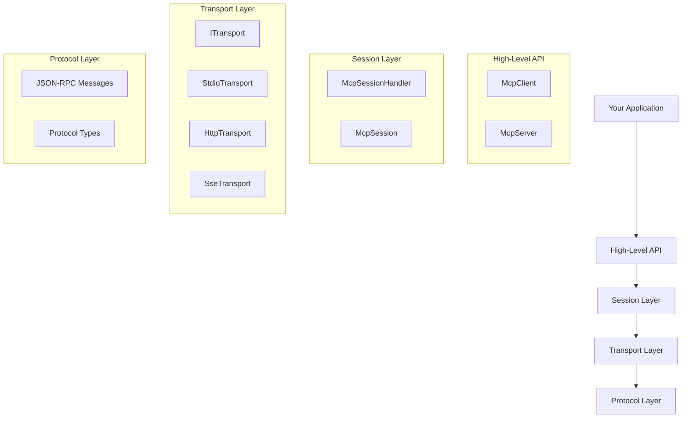
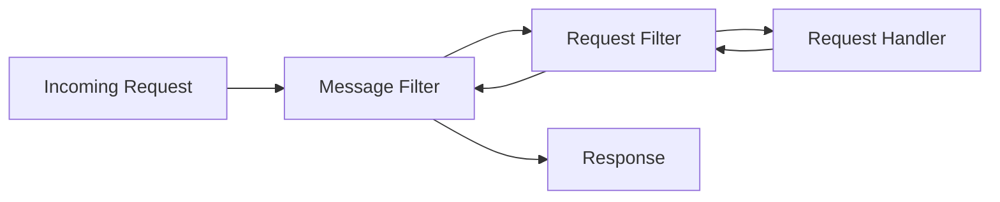

# Architecture

The MCP C# SDK is designed with a modular, layered architecture that separates concerns and provides flexibility for different deployment scenarios.

## Package Structure

The SDK is distributed as three NuGet packages, each building on the previous:

<Accordion title="ModelContextProtocol.Core">
  The foundational package providing core protocol implementation with minimal dependencies.
  
  **Use when:**
  - You need only client functionality
  - You're building low-level server implementations
  - You want minimal dependencies
  
  **Key namespaces:**
  - `ModelContextProtocol.Protocol` - Protocol types and JSON-RPC messages
  - `ModelContextProtocol.Client` - Client implementation and transports
  - `ModelContextProtocol.Server` - Low-level server primitives
</Accordion>

<Accordion title="ModelContextProtocol">
  The main package adding hosting, dependency injection, and attribute-based discovery.
  
  **Use when:**
  - Building stdio-based servers
  - You want hosting and DI support
  - You need attribute-based tool/prompt/resource registration
  
  **Additional features:**
  - `AddMcpServer()` extension for `IServiceCollection`
  - Attribute-based discovery (`[McpServerTool]`, `[McpServerPrompt]`, `[McpServerResource]`)
  - `IHostedService` integration
  - Stdio server transport configuration
  
  **References:** `ModelContextProtocol.Core`
</Accordion>

<Accordion title="ModelContextProtocol.AspNetCore">
  ASP.NET Core integration for HTTP-based MCP servers.
  
  **Use when:**
  - Building HTTP-based servers (Streamable HTTP or SSE)
  - You need ASP.NET Core middleware integration
  - You want session management and state persistence
  
  **Additional features:**
  - `MapMcp()` endpoint routing
  - HTTP transport configuration
  - Session management for stateless HTTP servers
  - Distributed cache support for event streams
  
  **References:** `ModelContextProtocol`
</Accordion>

## Core Architecture Layers

The SDK follows a layered architecture:



### Protocol Layer

Defines the core MCP protocol types and JSON-RPC message structures.

**Key types:**
- `JsonRpcMessage` - Base message type
- `JsonRpcRequest` - Request messages
- `JsonRpcResponse` - Response messages
- `JsonRpcNotification` - Notification messages
- Protocol capability types (`ClientCapabilities`, `ServerCapabilities`)
- Content types (`TextContentBlock`, `ImageContentBlock`, `EmbeddedResourceBlock`)

**Location:** `ModelContextProtocol.Protocol` namespace in Core package

### Transport Layer

Abstracts communication mechanisms between clients and servers.

**Core interface:**

```csharp
public interface ITransport : IAsyncDisposable
{
    string? SessionId { get; }
    ChannelReader<JsonRpcMessage> MessageReader { get; }
    Task SendMessageAsync(JsonRpcMessage message, CancellationToken cancellationToken = default);
}
```

**Available transports:**

| Transport | Client | Server | Use Case |
|-----------|--------|--------|----------|
| `StdioClientTransport` | ✓ | - | Launch child process servers |
| `StdioServerTransport` | - | ✓ | Stdio-based servers |
| `HttpClientTransport` | ✓ | - | Connect to HTTP servers |
| `StreamableHttpServerTransport` | - | ✓ | ASP.NET Core Streamable HTTP |
| `SseClientSessionTransport` | ✓ | - | Legacy SSE clients |
| `SseResponseStreamTransport` | - | ✓ | Legacy SSE servers |

**Location:** `ModelContextProtocol.Client` and `ModelContextProtocol.Server` namespaces

### Session Layer

Manages the lifecycle of MCP sessions and handles JSON-RPC message routing.

**Core class:** `McpSessionHandler`

**Responsibilities:**
- Protocol version negotiation
- Request/response correlation
- Notification dispatching
- Cancellation propagation
- Telemetry and diagnostics

**Base class:** `McpSession`

Provides common functionality for both clients and servers:

```csharp
public abstract class McpSession : IAsyncDisposable
{
    public abstract string? SessionId { get; }
    public abstract string? NegotiatedProtocolVersion { get; }
    
    public abstract Task<JsonRpcResponse> SendRequestAsync(
        JsonRpcRequest request, 
        CancellationToken cancellationToken = default);
    
    public abstract Task SendMessageAsync(
        JsonRpcMessage message, 
        CancellationToken cancellationToken = default);
    
    public abstract IAsyncDisposable RegisterNotificationHandler(
        string method, 
        Func<JsonRpcNotification, CancellationToken, ValueTask> handler);
}
```

### High-Level API

Provides strongly-typed, feature-specific APIs for clients and servers.

<CodeGroup>

```csharp Client API
public abstract class McpClient : McpSession
{
    public abstract ServerCapabilities ServerCapabilities { get; }
    public abstract Implementation ServerInfo { get; }
    public abstract string? ServerInstructions { get; }
    
    // Tool methods
    public abstract Task<IList<McpClientTool>> ListToolsAsync(...);
    public abstract Task<CallToolResult> CallToolAsync(...);
    
    // Resource methods
    public abstract Task<IList<McpClientResource>> ListResourcesAsync(...);
    public abstract Task<ReadResourceResult> ReadResourceAsync(...);
    public abstract Task SubscribeToResourceAsync(...);
    
    // Prompt methods
    public abstract Task<IList<McpClientPrompt>> ListPromptsAsync(...);
    public abstract Task<GetPromptResult> GetPromptAsync(...);
    
    // Additional features...
}
```

```csharp Server API
public abstract class McpServer : McpSession
{
    public abstract ClientCapabilities? ClientCapabilities { get; }
    public abstract Implementation? ClientInfo { get; }
    public abstract McpServerOptions ServerOptions { get; }
    public abstract IServiceProvider? Services { get; }
    
    // Server-to-client requests
    public abstract Task<CreateMessageResult> RequestSamplingAsync(...);
    public abstract Task<ListRootsResult> RequestRootsAsync(...);
    public abstract Task<ElicitResult> RequestElicitationAsync(...);
    
    // Notifications
    public abstract Task SendProgressNotificationAsync(...);
    public abstract Task SendLogMessageAsync(...);
    public abstract Task SendResourceUpdatedNotificationAsync(...);
    
    public abstract Task RunAsync(CancellationToken cancellationToken = default);
}
```

</CodeGroup>

## Server Handler Architecture

Servers use a handler-based architecture for processing requests:



### Handler Types

<Tabs>
  <Tab title="Request Handlers">
    Process incoming requests and return responses.
    
    ```csharp
    public delegate ValueTask<TResult> McpRequestHandler<TParams, TResult>(
        TParams parameters,
        RequestContext context,
        CancellationToken cancellationToken)
        where TParams : class
        where TResult : class;
    ```
    
    **Examples:**
    - Tool invocation handler
    - Resource read handler
    - Prompt get handler
  </Tab>
  
  <Tab title="Notification Handlers">
    Process incoming notifications (no response).
    
    ```csharp
    public delegate ValueTask McpMessageHandler<TParams>(
        TParams parameters,
        MessageContext context,
        CancellationToken cancellationToken)
        where TParams : class;
    ```
    
    **Examples:**
    - Progress notification handler
    - Cancellation notification handler
    - Resource updated handler
  </Tab>
  
  <Tab title="Primitives (Tools/Prompts/Resources)">
    Registered via attributes or programmatically.
    
    ```csharp
    [McpServerToolType]
    public static class MyTools
    {
        [McpServerTool]
        [Description("Gets the weather")]
        public static string GetWeather(string location)
        {
            return $"Sunny in {location}";
        }
    }
    ```
    
    Internally wrapped as `AIFunctionMcpServerTool` instances.
  </Tab>
</Tabs>

### Filter Pipeline

Filters provide cross-cutting concerns:

**Message Filters** - Apply to all messages (requests, responses, notifications)
```csharp
public delegate ValueTask<JsonRpcMessage> JsonRpcMessageFilter(
    JsonRpcMessage message,
    Func<JsonRpcMessage, ValueTask<JsonRpcMessage>> next);
```

**Request Filters** - Apply only to request/response pairs
```csharp
public delegate ValueTask<TResult> McpRequestFilter<TParams, TResult>(
    TParams parameters,
    RequestContext context,
    Func<TParams, ValueTask<TResult>> next,
    CancellationToken cancellationToken);
```

**Use cases:**
- Logging and telemetry
- Authentication/authorization
- Request validation
- Error handling
- Performance monitoring

## Dependency Injection Integration

The SDK integrates deeply with Microsoft.Extensions.DependencyInjection:

```csharp
var builder = Host.CreateApplicationBuilder(args);

// Register MCP server with DI
builder.Services
    .AddMcpServer()
    .WithStdioServerTransport()
    .WithTools<WeatherTools>()
    .WithPrompts<MyPrompts>()
    .WithResources<MyResources>();

// Tools can use constructor injection
[McpServerToolType]
public class WeatherTools(IWeatherService weatherService, ILogger<WeatherTools> logger)
{
    [McpServerTool]
    public async Task<string> GetWeatherAsync(string location)
    {
        logger.LogInformation("Getting weather for {Location}", location);
        return await weatherService.GetWeatherAsync(location);
    }
}
```

**Service Scoping:**

By default, each request creates a new service scope (`McpServerOptions.ScopeRequests = true`). This ensures:
- Scoped services are isolated per request
- Proper disposal of scoped resources
- Thread-safe service resolution

## Protocol Version Support

The SDK supports multiple protocol versions with automatic negotiation:

**Supported versions:**
- `2024-11-05` (initial release)
- `2025-03-26`
- `2025-06-18`
- `2025-11-25` (latest, adds session resumption)

**Version negotiation:**
1. Client sends `initialize` request with desired version
2. Server responds with matching or compatible version
3. Both sides use negotiated version for the session

**Version-specific features:**
```csharp
// Check negotiated version
if (client.NegotiatedProtocolVersion == "2025-11-25")
{
    // Use session resumption
    await client.ResumeSessionAsync(...);
}
```

<Info>
The `McpSessionHandler.LatestProtocolVersion` constant defines the newest version: `"2025-11-25"`
</Info>

## Threading and Concurrency

**Message Processing:**
- Each session has a dedicated message processing task
- Messages are read from `ITransport.MessageReader` (a `ChannelReader<JsonRpcMessage>`)
- Handlers execute concurrently unless constrained by user code

**Cancellation:**
- Requests include automatic cancellation token propagation
- Clients can send `notifications/cancelled` to request server-side cancellation
- Servers track in-flight requests and can cancel handlers

**Thread Safety:**
- `McpClient` and `McpServer` are thread-safe for concurrent requests
- Transports handle message serialization synchronization
- Pending request tracking uses `ConcurrentDictionary`

## Telemetry and Diagnostics

The SDK emits telemetry using `System.Diagnostics.Metrics`:

**Metrics:**
- `mcp.client.session.duration` - Client session lifetime
- `mcp.server.session.duration` - Server session lifetime
- `mcp.client.operation.duration` - Client request/notification duration
- `mcp.server.operation.duration` - Server handler duration

**Logging:**
All components accept `ILoggerFactory` for diagnostic logging:
```csharp
var transport = new StdioClientTransport(options, loggerFactory);
```

<Tip>
Enable structured logging to capture detailed diagnostic information including session IDs, protocol versions, and operation metrics.
</Tip>

## Next Steps

<CardGroup cols={2}>
  <Card title="Client Concepts" icon="laptop" href="/concepts/clients">
    Learn about client implementation and session management
  </Card>
  <Card title="Server Concepts" icon="server" href="/concepts/servers">
    Understand server handler architecture
  </Card>
  <Card title="Transports" icon="arrows-left-right" href="/concepts/transports">
    Explore transport options and configuration
  </Card>
  <Card title="Capabilities" icon="toggle-on" href="/concepts/capabilities">
    Configure capability negotiation
  </Card>
</CardGroup>