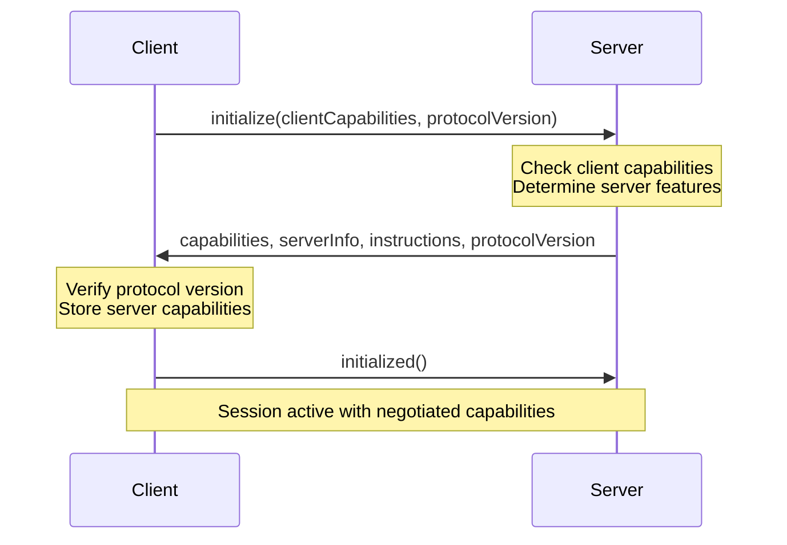

# Capabilities

Capabilities define the features supported by MCP clients and servers. During the initialization handshake, both sides exchange capability information to determine which protocol features are available for the session.

## How Capability Negotiation Works

Capability negotiation occurs during the initialization handshake:



**Key points:**
1. Client sends its capabilities and desired protocol version
2. Server responds with its capabilities and actual protocol version
3. Both sides store the other's capabilities
4. Features are only used if both sides support them

## Client Capabilities

`ClientCapabilities` defines what features the client can handle:

```csharp
public sealed class ClientCapabilities
{
    public RootsCapability? Roots { get; set; }
    public SamplingCapability? Sampling { get; set; }
    public ElicitationCapability? Elicitation { get; set; }
    public IDictionary<string, object>? Experimental { get; set; }
}
```

### Configuring Client Capabilities

```csharp
using ModelContextProtocol.Client;
using ModelContextProtocol.Protocol;

var options = new McpClientOptions
{
    Capabilities = new ClientCapabilities
    {
        Roots = new RootsCapability 
        { 
            ListChanged = true // Support dynamic root list updates
        },
        
        Sampling = new SamplingCapability(),
        
        Elicitation = new ElicitationCapability
        {
            Form = new FormElicitationCapability(),
            Url = new UrlElicitationCapability()
        }
    }
};

var client = await McpClient.CreateAsync(transport, options);
```

### Roots Capability

Indicates the client can provide filesystem root URIs to the server:

```csharp
public sealed class RootsCapability
{
    public bool? ListChanged { get; set; }
}
```

**Properties:**
- `ListChanged` - If `true`, client can send `notifications/roots/list_changed` when roots change

**Implementation:**

```csharp
var options = new McpClientOptions
{
    Capabilities = new ClientCapabilities
    {
        Roots = new RootsCapability { ListChanged = true }
    },
    Handlers = new McpClientHandlers
    {
        RootsHandler = async (context, ct) =>
        {
            return new ListRootsResult
            {
                Roots = new[]
                {
                    new Root
                    {
                        Uri = "file:///workspace",
                        Name = "Workspace"
                    },
                    new Root
                    {
                        Uri = "file:///documents",
                        Name = "Documents"
                    }
                }
            };
        }
    }
};
```

### Sampling Capability

Indicates the client can issue LLM requests on behalf of the server:

```csharp
public sealed class SamplingCapability
{
    // Currently no properties
}
```

**Implementation:**

```csharp
Handlers = new McpClientHandlers
{
    SamplingHandler = async (request, context, ct) =>
    {
        var chatClient = GetChatClient();
        
        var messages = request.Messages.Select(m => new ChatMessage
        {
            Role = m.Role == PromptRole.User ? ChatRole.User : ChatRole.Assistant,
            Contents = m.Content.Text
        }).ToList();
        
        var response = await chatClient.GetResponseAsync(
            messages, 
            new ChatOptions { MaxTokens = request.MaxTokens },
            cancellationToken: ct);
        
        return new CreateMessageResult
        {
            Role = PromptRole.Assistant,
            Content = new TextContentBlock { Text = response.Message.Text },
            Model = response.ModelId,
            StopReason = response.FinishReason?.ToString() ?? "endTurn"
        };
    }
}
```

### Elicitation Capability

Indicates the client can request additional information from users:

```csharp
public sealed class ElicitationCapability
{
    public FormElicitationCapability? Form { get; set; }
    public UrlElicitationCapability? Url { get; set; }
}
```

**Form elicitation** - Display forms to collect structured input:

```csharp
Handlers = new McpClientHandlers
{
    ElicitationHandler = async (request, context, ct) =>
    {
        if (request.Form is not null)
        {
            // Display form UI
            var dialog = new FormDialog(request.Form.Title, request.Form.Description);
            
            foreach (var field in request.Form.Fields)
            {
                dialog.AddField(field.Name, field.Label, field.Type, field.Required);
            }
            
            var userInput = await dialog.ShowAsync();
            
            return new ElicitResult
            {
                Form = new FormElicitationResult
                {
                    Values = userInput
                }
            };
        }
        
        throw new InvalidOperationException("Form elicitation not supported");
    }
}
```

**URL elicitation** - Open URLs for user authentication/authorization:

```csharp
if (request.Url is not null)
{
    // Open URL in browser
    var url = request.Url.Url;
    Process.Start(new ProcessStartInfo { FileName = url, UseShellExecute = true });
    
    return new ElicitResult
    {
        Url = new UrlElicitationResult()
    };
}
```

## Server Capabilities

`ServerCapabilities` defines what features the server exposes:

```csharp
public sealed class ServerCapabilities
{
    public ToolsCapability? Tools { get; set; }
    public PromptsCapability? Prompts { get; set; }
    public ResourcesCapability? Resources { get; set; }
    public LoggingCapability? Logging { get; set; }
    public CompletionsCapability? Completions { get; set; }
    public IDictionary<string, object>? Experimental { get; set; }
}
```

### Configuring Server Capabilities

Capabilities are typically auto-configured based on registered features:

```csharp
builder.Services
    .AddMcpServer() // Capabilities auto-detected
    .WithTools<MyTools>() // → Tools capability added
    .WithPrompts<MyPrompts>() // → Prompts capability added
    .WithResources<MyResources>(); // → Resources capability added
```

**Manual configuration:**

```csharp
builder.Services.AddMcpServer(options =>
{
    options.Capabilities = new ServerCapabilities
    {
        Tools = new ToolsCapability { ListChanged = true },
        Prompts = new PromptsCapability { ListChanged = true },
        Resources = new ResourcesCapability 
        { 
            Subscribe = true,
            ListChanged = true 
        },
        Logging = new LoggingCapability(),
        Completions = new CompletionsCapability()
    };
});
```

### Tools Capability

```csharp
public sealed class ToolsCapability
{
    public bool? ListChanged { get; set; }
}
```

**Properties:**
- `ListChanged` - If `true`, server can send `notifications/tools/list_changed`

**Usage:**

```csharp
public class DynamicToolServer(McpServer server)
{
    private readonly List<McpServerTool> _tools = new();
    
    public async Task RegisterToolAsync(McpServerTool tool)
    {
        _tools.Add(tool);
        
        // Notify clients if capability is set
        if (server.ServerOptions.Capabilities?.Tools?.ListChanged == true)
        {
            await server.SendToolListChangedNotificationAsync();
        }
    }
}
```

### Prompts Capability

```csharp
public sealed class PromptsCapability
{
    public bool? ListChanged { get; set; }
}
```

**Properties:**
- `ListChanged` - If `true`, server can send `notifications/prompts/list_changed`

### Resources Capability

```csharp
public sealed class ResourcesCapability
{
    public bool? Subscribe { get; set; }
    public bool? ListChanged { get; set; }
}
```

**Properties:**
- `Subscribe` - If `true`, clients can subscribe to resource updates
- `ListChanged` - If `true`, server can send `notifications/resources/list_changed`

**Implementation:**

```csharp
[McpServerResourceType]
public class ConfigResource(McpServer server)
{
    private string _config = "initial";
    
    [McpServerResource("config://app/settings")]
    public Task<ReadResourceResult> GetConfigAsync()
    {
        return Task.FromResult(new ReadResourceResult
        {
            Contents = new[] 
            { 
                new TextResourceContents 
                { 
                    Uri = "config://app/settings",
                    Text = _config 
                } 
            }
        });
    }
    
    public async Task UpdateConfigAsync(string newConfig)
    {
        _config = newConfig;
        
        // Send update notification if subscriptions are supported
        if (server.ServerOptions.Capabilities?.Resources?.Subscribe == true)
        {
            await server.SendResourceUpdatedNotificationAsync("config://app/settings");
        }
    }
}
```

### Logging Capability

```csharp
public sealed class LoggingCapability
{
    // Currently no properties
}
```

Enables `logging/setLevel` request and `notifications/message` for log messages.

### Completions Capability

```csharp
public sealed class CompletionsCapability
{
    // Currently no properties
}
```

Enables `completion/complete` for argument auto-completion in prompts and resource templates.

## Checking Capabilities

Always check capabilities before using optional features.

### Client Checking Server Capabilities

```csharp
// Check if server supports tools
if (client.ServerCapabilities.Tools is not null)
{
    var tools = await client.ListToolsAsync();
}

// Check for specific capability features
if (client.ServerCapabilities.Resources is { Subscribe: true })
{
    await client.SubscribeToResourceAsync(uri);
}

// Check for list change notifications
if (client.ServerCapabilities.Prompts is { ListChanged: true })
{
    client.RegisterNotificationHandler(
        NotificationMethods.PromptListChangedNotification,
        async (notification, ct) =>
        {
            var prompts = await client.ListPromptsAsync(cancellationToken: ct);
            // Update UI with new prompts
        });
}

// Check multiple capabilities
if (client.ServerCapabilities is 
    { 
        Tools: not null, 
        Resources: { Subscribe: true },
        Logging: not null 
    })
{
    // Server supports tools, resource subscriptions, and logging
}
```

### Server Checking Client Capabilities

```csharp
public class ServerTool(McpServer server)
{
    [McpServerTool]
    public async Task<string> OperationRequiringSamplingAsync(string prompt)
    {
        // Check if client supports sampling
        if (server.ClientCapabilities?.Sampling is null)
        {
            return "Error: Client does not support LLM sampling";
        }
        
        var result = await server.RequestSamplingAsync(new CreateMessageRequestParams
        {
            Messages = new[] 
            { 
                new PromptMessage 
                { 
                    Role = PromptRole.User,
                    Content = new TextContentBlock { Text = prompt }
                } 
            },
            MaxTokens = 100
        });
        
        return result.Content.Text;
    }
    
    [McpServerTool]
    public async Task<string> GetUserRootsAsync()
    {
        if (server.ClientCapabilities?.Roots is null)
        {
            return "Client does not expose filesystem roots";
        }
        
        var roots = await server.RequestRootsAsync();
        return string.Join("\n", roots.Roots.Select(r => $"{r.Name}: {r.Uri}"));
    }
}
```

## Protocol Version Negotiation

The SDK supports multiple protocol versions with automatic negotiation.

### Supported Versions

```csharp
// From McpSessionHandler.cs
internal static readonly string[] SupportedProtocolVersions =
[
    "2024-11-05",  // Initial release
    "2025-03-26",  // Updates
    "2025-06-18",  // Updates
    "2025-11-25",  // Latest (adds session resumption)
];

internal const string LatestProtocolVersion = "2025-11-25";
```

### Client Version Preferences

```csharp
var options = new McpClientOptions
{
    // Request specific version
    ProtocolVersion = "2025-11-25"
    
    // Or use null for flexible negotiation (default)
    // ProtocolVersion = null
};

var client = await McpClient.CreateAsync(transport, options);
```

**Behavior:**
- **Explicit version** (`"2025-11-25"`) - Requires exact match, fails if server doesn't support it
- **Null** (default) - Accepts any supported version, uses latest common version

### Server Version Configuration

```csharp
builder.Services.AddMcpServer(options =>
{
    // Advertise specific version
    options.ProtocolVersion = "2025-11-25";
    
    // Or use null to match client's request if supported
    // options.ProtocolVersion = null;
});
```

**Behavior:**
- **Explicit version** - Always advertises this version
- **Null** (default) - Responds with client's requested version if supported, otherwise latest

### Accessing Negotiated Version

```csharp
// From client
string? version = client.NegotiatedProtocolVersion;
Console.WriteLine($"Using protocol version: {version}");

// From server (in handlers)
string? version = server.NegotiatedProtocolVersion;
```

### Version-Specific Features

Some features require specific protocol versions:

```csharp
// Session resumption requires 2025-11-25+
if (client.NegotiatedProtocolVersion == "2025-11-25")
{
    // Can use session resumption
    var sessionId = client.SessionId;
    // Save for later resumption
}

// Check for version in implementation
if (string.Compare(
    server.NegotiatedProtocolVersion, 
    "2025-11-25", 
    StringComparison.Ordinal) >= 0)
{
    // Use 2025-11-25 features
}
```

## Experimental Capabilities

Both client and server capabilities include an `Experimental` dictionary for non-standard features:

```csharp
// Client experimental capability
var options = new McpClientOptions
{
    Capabilities = new ClientCapabilities
    {
        Experimental = new Dictionary<string, object>
        {
            ["customFeature"] = new { enabled = true, version = "1.0" }
        }
    }
};

// Server experimental capability
options.Capabilities = new ServerCapabilities
{
    Experimental = new Dictionary<string, object>
    {
        ["customFeature"] = new { supported = true }
    }
};

// Check experimental capability
if (client.ServerCapabilities.Experimental?.ContainsKey("customFeature") == true)
{
    // Use custom feature
}
```

<Warning>
Experimental capabilities are not part of the MCP specification. Coordinate with the other party to ensure compatibility.
</Warning>

## Best Practices

<AccordionGroup>
  <Accordion title="Always check capabilities before using features">
    ```csharp
    // Good
    if (client.ServerCapabilities.Resources?.Subscribe == true)
    {
        await client.SubscribeToResourceAsync(uri);
    }
    else
    {
        // Fall back to polling
        while (true)
        {
            var resource = await client.ReadResourceAsync(uri);
            await Task.Delay(1000);
        }
    }
    
    // Bad - may throw if server doesn't support subscriptions
    await client.SubscribeToResourceAsync(uri);
    ```
  </Accordion>
  
  <Accordion title="Use null protocol version for maximum compatibility">
    ```csharp
    // Good - works with all server versions
    var options = new McpClientOptions
    {
        ProtocolVersion = null // or omit
    };
    
    // Only specify version when you need specific features
    var options = new McpClientOptions
    {
        ProtocolVersion = "2025-11-25" // Required for session resumption
    };
    ```
  </Accordion>
  
  <Accordion title="Enable ListChanged for dynamic servers">
    ```csharp
    options.Capabilities = new ServerCapabilities
    {
        Tools = new ToolsCapability { ListChanged = true },
        Prompts = new PromptsCapability { ListChanged = true },
        Resources = new ResourcesCapability 
        { 
            Subscribe = true,
            ListChanged = true 
        }
    };
    ```
    
    This allows efficient updates without polling.
  </Accordion>
  
  <Accordion title="Provide clear error messages when capabilities are missing">
    ```csharp
    [McpServerTool]
    public async Task<string> RequiresSamplingAsync()
    {
        if (server.ClientCapabilities?.Sampling is null)
        {
            return "This operation requires a client with LLM sampling capability. " +
                   "Please use a client that supports the 'sampling' capability.";
        }
        
        // Proceed with sampling
    }
    ```
  </Accordion>
</AccordionGroup>

## Next Steps

<CardGroup cols={2}>
  <Card title="Architecture" icon="sitemap" href="/concepts/architecture">
    Understand the SDK architecture
  </Card>
  <Card title="Clients" icon="laptop" href="/concepts/clients">
    Learn about client implementation
  </Card>
</CardGroup>