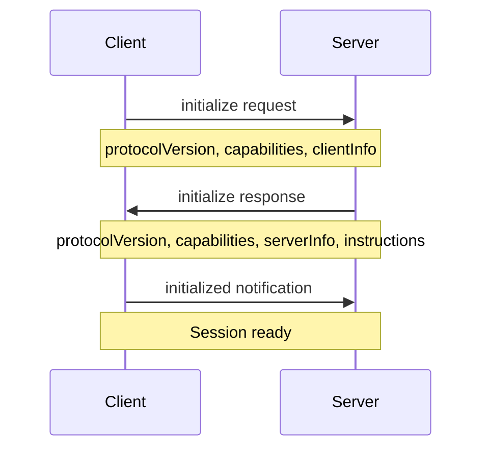

# Clients

MCP clients connect to servers, discover capabilities, and invoke tools, prompts, and resources. The C# SDK provides a high-level `McpClient` class that handles protocol details, session management, and transport abstraction.

## Creating a Client

Clients are created using the `McpClient.CreateAsync` factory method:

```csharp
using ModelContextProtocol.Client;
using ModelContextProtocol.Protocol;

var transport = new StdioClientTransport(new StdioClientTransportOptions
{
    Command = "npx",
    Arguments = ["-y", "@modelcontextprotocol/server-everything"],
});

await using var client = await McpClient.CreateAsync(transport);
```

### Client Options

Configure client behavior using `McpClientOptions`:

```csharp
var options = new McpClientOptions
{
    ClientInfo = new Implementation
    {
        Name = "MyClient",
        Version = "1.0.0",
        Description = "My custom MCP client"
    },
    Capabilities = new ClientCapabilities
    {
        Sampling = new SamplingCapability(),
        Roots = new RootsCapability { ListChanged = true },
        Elicitation = new ElicitationCapability
        {
            Form = new FormElicitationCapability(),
            Url = new UrlElicitationCapability()
        }
    },
    ProtocolVersion = "2025-11-25",
    InitializationTimeout = TimeSpan.FromSeconds(30)
};

await using var client = await McpClient.CreateAsync(transport, options);
```

<Info>
If `ClientInfo` is not specified, the SDK automatically populates it with information from the current process.
</Info>

## Client Lifecycle

### Initialization Handshake

When `CreateAsync` is called, the client performs an initialization handshake:



**Steps:**
1. Client sends `initialize` request with protocol version and capabilities
2. Server responds with its capabilities, info, and optional instructions
3. Client sends `initialized` notification to confirm
4. Session is now active and ready for requests

### Session Properties

After initialization, client properties are populated:

```csharp
// Server information
ServerCapabilities capabilities = client.ServerCapabilities;
Implementation serverInfo = client.ServerInfo;
string? instructions = client.ServerInstructions;

// Session details
string? sessionId = client.SessionId;
string? version = client.NegotiatedProtocolVersion;

console.WriteLine($"Connected to {serverInfo.Name} v{serverInfo.Version}");
console.WriteLine($"Protocol version: {version}");
console.WriteLine($"Session ID: {sessionId}");
```

### Disposal

Clients implement `IAsyncDisposable` and should be disposed when done:

```csharp
await using var client = await McpClient.CreateAsync(transport);
// Use client...
// Automatically disposed at end of scope
```

**Disposal behavior:**
- Disposes the underlying transport
- Cancels in-flight requests
- Releases resources
- For stdio transports, terminates the child process

### Completion Tracking

Monitor session completion using the `Completion` property:

```csharp
var client = await McpClient.CreateAsync(transport);

// Start a task to monitor completion
_ = Task.Run(async () =>
{
    ClientCompletionDetails details = await client.Completion;
    
    if (details.Exception is null)
    {
        Console.WriteLine("Session completed gracefully");
    }
    else
    {
        Console.WriteLine($"Session failed: {details.Exception.Message}");
    }
    
    // For stdio transports, check exit code
    if (details is StdioClientCompletionDetails stdioDetails)
    {
        Console.WriteLine($"Process exit code: {stdioDetails.ExitCode}");
    }
});
```

<Note>
The `Completion` task always completes successfully. Check the `Exception` property to determine if the session ended normally or due to an error.
</Note>

## Working with Tools

### Listing Tools

Discover available tools from the server:

```csharp
if (client.ServerCapabilities.Tools is not null)
{
    IList<McpClientTool> tools = await client.ListToolsAsync();
    
    foreach (var tool in tools)
    {
        Console.WriteLine($"{tool.Name}: {tool.Description}");
        
        // Tools are AIFunction instances
        AIFunctionMetadata metadata = tool.Metadata;
        foreach (var param in metadata.Parameters)
        {
            Console.WriteLine($"  - {param.Name}: {param.Description}");
        }
    }
}
```

### Calling Tools

Invoke tools using the `CallToolAsync` method:

```csharp
var result = await client.CallToolAsync(
    "get_weather",
    new Dictionary<string, object?>
    {
        ["location"] = "San Francisco",
        ["units"] = "celsius"
    });

// Process content blocks
foreach (var content in result.Content)
{
    switch (content)
    {
        case TextContentBlock text:
            Console.WriteLine(text.Text);
            break;
            
        case ImageContentBlock image:
            Console.WriteLine($"Image: {image.MimeType}");
            // Process image.Data or image.Uri
            break;
            
        case EmbeddedResourceBlock resource:
            Console.WriteLine($"Resource: {resource.Resource.Uri}");
            break;
    }
}
```

### Using Tools with LLMs

`McpClientTool` inherits from `AIFunction`, enabling seamless integration with `IChatClient`:

```csharp
using Microsoft.Extensions.AI;

// Get tools from MCP server
IList<McpClientTool> mcpTools = await client.ListToolsAsync();

// Use with any IChatClient
IChatClient chatClient = new OpenAIClient(apiKey).AsChatClient("gpt-4");

var response = await chatClient.GetResponseAsync(
    "What's the weather like in Tokyo?",
    new ChatOptions
    {
        Tools = [.. mcpTools]
    });

Console.WriteLine(response.Message.Text);
```

The chat client automatically:
1. Provides tool definitions to the LLM
2. Executes tool calls via MCP when requested
3. Returns results to the LLM for response generation

## Working with Resources

### Listing Resources

```csharp
if (client.ServerCapabilities.Resources is not null)
{
    IList<McpClientResource> resources = await client.ListResourcesAsync();
    
    foreach (var resource in resources)
    {
        Console.WriteLine($"{resource.Name} ({resource.Uri})");
        Console.WriteLine($"  Type: {resource.MimeType}");
        Console.WriteLine($"  Description: {resource.Description}");
    }
}
```

### Reading Resources

```csharp
var result = await client.ReadResourceAsync("file:///path/to/file.txt");

foreach (var content in result.Contents)
{
    if (content is TextResourceContents textContent)
    {
        Console.WriteLine(textContent.Text);
    }
    else if (content is BlobResourceContents blobContent)
    {
        byte[] data = Convert.FromBase64String(blobContent.Blob);
        // Process binary data
    }
}
```

### Resource Templates

Some resources use URI templates:

```csharp
// List resource templates
IList<McpClientResourceTemplate> templates = await client.ListResourcesAsync();

var fileTemplate = templates.First(t => t.UriTemplate.Contains("{path}"));

// Read using template
var uri = fileTemplate.UriTemplate.Replace("{path}", "data/config.json");
var result = await client.ReadResourceAsync(uri);
```

### Subscribing to Resources

If the server supports subscriptions:

```csharp
if (client.ServerCapabilities.Resources is { Subscribe: true })
{
    // Subscribe to resource changes
    await client.SubscribeToResourceAsync("config://app/settings");
    
    // Handle update notifications
    client.RegisterNotificationHandler(
        NotificationMethods.ResourceUpdatedNotification,
        async (notification, ct) =>
        {
            var @params = notification.GetParams<ResourceUpdatedNotificationParams>();
            Console.WriteLine($"Resource updated: {@params.Uri}");
            
            // Re-read the resource
            var updated = await client.ReadResourceAsync(@params.Uri, cancellationToken: ct);
            // Process updated content
        });
}
```

## Working with Prompts

### Listing Prompts

```csharp
if (client.ServerCapabilities.Prompts is not null)
{
    IList<McpClientPrompt> prompts = await client.ListPromptsAsync();
    
    foreach (var prompt in prompts)
    {
        Console.WriteLine($"{prompt.Name}: {prompt.Description}");
        
        if (prompt.Arguments is not null)
        {
            foreach (var arg in prompt.Arguments)
            {
                Console.WriteLine($"  Argument: {arg.Name} (required: {arg.Required})");
            }
        }
    }
}
```

### Getting Prompts

```csharp
var result = await client.GetPromptAsync(
    "code_review",
    new Dictionary<string, string>
    {
        ["language"] = "csharp",
        ["file_path"] = "src/Program.cs"
    });

// Use prompt messages with chat client
var messages = new List<ChatMessage>();

foreach (var message in result.Messages)
{
    var chatMessage = new ChatMessage
    {
        Role = message.Role == PromptRole.User ? ChatRole.User : ChatRole.Assistant,
        Contents = message.Content.Text // Simplified
    };
    messages.Add(chatMessage);
}

var response = await chatClient.GetResponseAsync(messages);
```

## Handling Server Requests

Servers can request capabilities from clients. Implement handlers to respond:

### Sampling Handler

Handle LLM sampling requests from the server:

```csharp
var options = new McpClientOptions
{
    Capabilities = new ClientCapabilities
    {
        Sampling = new SamplingCapability()
    },
    Handlers = new McpClientHandlers
    {
        SamplingHandler = async (request, context, ct) =>
        {
            // Use your LLM client
            var chatClient = GetChatClient();
            
            var messages = request.Messages.Select(m => new ChatMessage
            {
                Role = m.Role == PromptRole.User ? ChatRole.User : ChatRole.Assistant,
                Contents = m.Content.Text
            }).ToList();
            
            var response = await chatClient.GetResponseAsync(messages, cancellationToken: ct);
            
            return new CreateMessageResult
            {
                Role = PromptRole.Assistant,
                Content = new TextContentBlock { Text = response.Message.Text },
                Model = request.ModelPreferences?.Hints?.First()?.Name ?? "unknown",
                StopReason = "endTurn"
            };
        }
    }
};
```

### Roots Handler

Provide filesystem roots to the server:

```csharp
Handlers = new McpClientHandlers
{
    RootsHandler = async (context, ct) =>
    {
        return new ListRootsResult
        {
            Roots = new[]
            {
                new Root
                {
                    Uri = "file:///home/user/projects",
                    Name = "Projects"
                },
                new Root
                {
                    Uri = "file:///home/user/documents",
                    Name = "Documents"
                }
            }
        };
    }
}
```

### Elicitation Handler

Prompt users for additional information:

```csharp
Handlers = new McpClientHandlers
{
    ElicitationHandler = async (request, context, ct) =>
    {
        if (request.Form is not null)
        {
            // Display form to user and collect input
            var userInput = await ShowFormToUserAsync(request.Form);
            
            return new ElicitResult
            {
                Form = new FormElicitationResult
                {
                    Values = userInput
                }
            };
        }
        else if (request.Url is not null)
        {
            // Open URL in browser
            await OpenUrlAsync(request.Url.Url);
            
            return new ElicitResult
            {
                Url = new UrlElicitationResult()
            };
        }
        
        throw new InvalidOperationException("Unknown elicitation type");
    }
}
```

## Notification Handlers

Register handlers for server notifications:

```csharp
// Handle progress notifications
client.RegisterNotificationHandler(
    NotificationMethods.ProgressNotification,
    async (notification, ct) =>
    {
        var progress = notification.GetParams<ProgressNotificationParams>();
        Console.WriteLine($"Progress: {progress.Progress}/{progress.Total}");
    });

// Handle log messages
client.RegisterNotificationHandler(
    NotificationMethods.LoggingMessageNotification,
    async (notification, ct) =>
    {
        var log = notification.GetParams<LoggingMessageNotificationParams>();
        Console.WriteLine($"[{log.Level}] {log.Data}");
    });

// Handle tool list changes
if (client.ServerCapabilities.Tools is { ListChanged: true })
{
    client.RegisterNotificationHandler(
        NotificationMethods.ToolListChangedNotification,
        async (notification, ct) =>
        {
            // Refresh tool list
            var tools = await client.ListToolsAsync(cancellationToken: ct);
            Console.WriteLine($"Tools updated: {tools.Count} available");
        });
}
```

<Tip>
Notification handlers return `IAsyncDisposable`. Dispose the registration to stop receiving notifications:

```csharp
var registration = client.RegisterNotificationHandler(...);
await registration.DisposeAsync(); // Unregister
```
</Tip>

## Session Resumption (Streamable HTTP)

For Streamable HTTP transports, sessions can be resumed after disconnection:

```csharp
// Initial connection
var transport = new HttpClientTransport(new HttpClientTransportOptions
{
    Endpoint = new Uri("https://mcp-server.example.com/mcp")
});

var client = await McpClient.CreateAsync(transport);

// Save session information
string sessionId = client.SessionId!;
ServerCapabilities capabilities = client.ServerCapabilities;
Implementation serverInfo = client.ServerInfo;

// Later, resume the session
var resumeTransport = new HttpClientTransport(new HttpClientTransportOptions
{
    Endpoint = new Uri("https://mcp-server.example.com/mcp"),
    KnownSessionId = sessionId
});

var resumedClient = await McpClient.ResumeSessionAsync(
    resumeTransport,
    new ResumeClientSessionOptions
    {
        ServerCapabilities = capabilities,
        ServerInfo = serverInfo
    });

// Session state is restored
```

<Note>
Session resumption is only supported on protocol version `2025-11-25` and later with Streamable HTTP transport.
</Note>

## Error Handling

### Protocol Exceptions

```csharp
try
{
    var result = await client.CallToolAsync("invalid_tool", new());
}
catch (McpException ex)
{
    Console.WriteLine($"MCP Error [{ex.Code}]: {ex.Message}");
    // ex.Code: McpErrorCode enum value
    // ex.Data: Additional error data
}
catch (McpProtocolException ex)
{
    Console.WriteLine($"Protocol Error: {ex.Message}");
    // Protocol-level errors (invalid messages, etc.)
}
```

### Transport Exceptions

```csharp
try
{
    var client = await McpClient.CreateAsync(transport);
}
catch (TransportClosedException ex)
{
    Console.WriteLine($"Transport closed: {ex.Message}");
}
catch (InvalidOperationException ex)
{
    Console.WriteLine($"Connection failed: {ex.Message}");
}
```

## Best Practices

<AccordionGroup>
  <Accordion title="Always check capabilities before using features">
    ```csharp
    // Good
    if (client.ServerCapabilities.Resources is { Subscribe: true })
    {
        await client.SubscribeToResourceAsync(uri);
    }
    
    // Bad - may throw if server doesn't support subscriptions
    await client.SubscribeToResourceAsync(uri);
    ```
  </Accordion>
  
  <Accordion title="Use async disposal for proper cleanup">
    ```csharp
    // Good
    await using var client = await McpClient.CreateAsync(transport);
    
    // Also good
    var client = await McpClient.CreateAsync(transport);
    try
    {
        // Use client
    }
    finally
    {
        await client.DisposeAsync();
    }
    ```
  </Accordion>
  
  <Accordion title="Implement timeout policies for long-running operations">
    ```csharp
    using var cts = new CancellationTokenSource(TimeSpan.FromSeconds(30));
    var result = await client.CallToolAsync("slow_tool", args, cancellationToken: cts.Token);
    ```
  </Accordion>
  
  <Accordion title="Monitor server instructions for usage guidance">
    ```csharp
    if (client.ServerInstructions is not null)
    {
        // Include in system prompt for LLM
        var systemPrompt = $"You have access to MCP tools. {client.ServerInstructions}";
    }
    ```
  </Accordion>
</AccordionGroup>

## Next Steps

<CardGroup cols={2}>
  <Card title="Server Concepts" icon="server" href="/concepts/servers">
    Learn about building MCP servers
  </Card>
  <Card title="Transports" icon="arrows-left-right" href="/concepts/transports">
    Explore transport options
  </Card>
</CardGroup>