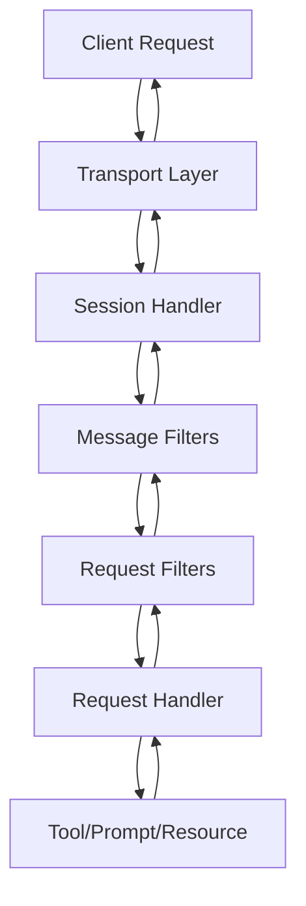

# Servers

MCP servers expose tools, prompts, and resources that clients can discover and invoke. The C# SDK provides flexible server implementations supporting both stdio and HTTP transports with attribute-based or programmatic registration.

## Server Architecture

Servers are built on a handler-based architecture:



## Creating a Server

### Stdio Server

For local servers communicating over standard input/output:

```csharp
using Microsoft.Extensions.DependencyInjection;
using Microsoft.Extensions.Hosting;
using ModelContextProtocol.Server;
using System.ComponentModel;

var builder = Host.CreateApplicationBuilder(args);

// Configure logging to stderr (stdout is used for MCP protocol)
builder.Logging.AddConsole(options =>
{
    options.LogToStandardErrorThreshold = LogLevel.Trace;
});

builder.Services
    .AddMcpServer()
    .WithStdioServerTransport()
    .WithToolsFromAssembly();

await builder.Build().RunAsync();

[McpServerToolType]
public static class MyTools
{
    [McpServerTool, Description("Echoes a message")]
    public static string Echo(string message) => message;
}
```

### HTTP Server (ASP.NET Core)

For remote servers using HTTP/SSE transport:

```csharp
using ModelContextProtocol.Server;
using System.ComponentModel;

var builder = WebApplication.CreateBuilder(args);

builder.Services.AddMcpServer()
    .WithHttpTransport()
    .WithToolsFromAssembly();

var app = builder.Build();

app.MapMcp(); // Maps to root by default
// or
app.MapMcp("/mcp"); // Custom route

app.Run();

[McpServerToolType]
public static class MyTools
{
    [McpServerTool, Description("Gets weather")]
    public static string GetWeather(string location) => $"Sunny in {location}";
}
```

## Server Options

Configure server behavior using `McpServerOptions`:

```csharp
builder.Services.AddMcpServer(options =>
{
    options.ServerInfo = new Implementation
    {
        Name = "MyServer",
        Version = "1.0.0",
        Description = "My custom MCP server"
    };
    
    options.ServerInstructions = 
        "This server provides weather and time tools. " +
        "Use get_weather for current conditions and get_time for current time.";
    
    options.Capabilities = new ServerCapabilities
    {
        Tools = new ToolsCapability { ListChanged = true },
        Prompts = new PromptsCapability { ListChanged = true },
        Resources = new ResourcesCapability { Subscribe = true, ListChanged = true },
        Logging = new LoggingCapability()
    };
    
    options.ProtocolVersion = "2025-11-25";
    options.InitializationTimeout = TimeSpan.FromSeconds(30);
    options.ScopeRequests = true; // Create new scope per request
});
```

<Info>
Capabilities are automatically inferred from registered tools, prompts, and resources. You only need to set them explicitly for fine-grained control (like enabling `ListChanged`).
</Info>

## Implementing Tools

Tools are callable functions exposed to clients.

### Attribute-Based Tools

The simplest approach uses attributes:

```csharp
[McpServerToolType]
public static class CalculatorTools
{
    [McpServerTool]
    [Description("Adds two numbers")]
    public static int Add(
        [Description("First number")] int a,
        [Description("Second number")] int b)
    {
        return a + b;
    }
    
    [McpServerTool]
    [Description("Multiplies two numbers")]
    public static int Multiply(int a, int b) => a * b;
}
```

**Registration:**
```csharp
builder.Services
    .AddMcpServer()
    .WithToolsFromAssembly(); // Discovers all [McpServerToolType] classes
```

### Instance-Based Tools with DI

Tools can be instance methods with dependency injection:

```csharp
[McpServerToolType]
public class WeatherTools(IWeatherService weatherService, ILogger<WeatherTools> logger)
{
    [McpServerTool]
    [Description("Gets current weather for a location")]
    public async Task<string> GetWeatherAsync(
        [Description("City name")] string location,
        [Description("Temperature units")] string units = "celsius")
    {
        logger.LogInformation("Fetching weather for {Location}", location);
        var weather = await weatherService.GetCurrentWeatherAsync(location, units);
        return $"Temperature: {weather.Temperature}°{units[0]}, Conditions: {weather.Conditions}";
    }
}
```

<Tip>
Register dependencies in DI:
```csharp
builder.Services.AddSingleton<IWeatherService, WeatherService>();
```
</Tip>

### Programmatic Tool Registration

For dynamic tools or wrapping existing functions:

```csharp
builder.Services
    .AddMcpServer()
    .WithTool(McpServerTool.Create(
        name: "custom_tool",
        description: "A custom tool",
        parameters: new[] 
        {
            new AIFunctionParameterMetadata("input") 
            { 
                Description = "Input text",
                ParameterType = typeof(string)
            }
        },
        returnParameter: new AIFunctionReturnParameterMetadata { ParameterType = typeof(string) },
        implementation: async (args, ct) => 
        {
            var input = args["input"] as string;
            return $"Processed: {input}";
        }));
```

### Complex Return Types

Tools can return rich content:

```csharp
[McpServerTool]
[Description("Analyzes an image")]
public static CallToolResult AnalyzeImage(string imageUrl)
{
    return new CallToolResult
    {
        Content = new ContentBlock[]
        {
            new TextContentBlock
            {
                Text = "Image analysis complete:"
            },
            new ImageContentBlock
            {
                MimeType = "image/jpeg",
                Uri = imageUrl
            },
            new TextContentBlock
            {
                Text = "Objects detected: cat, tree, house"
            }
        }
    };
}
```

## Implementing Prompts

Prompts are reusable message templates.

### Attribute-Based Prompts

```csharp
[McpServerPromptType]
public static class CodePrompts
{
    [McpServerPrompt]
    [Description("Reviews code for best practices")]
    public static GetPromptResult CodeReview(
        [Description("Programming language")] string language,
        [Description("Code to review")] string code)
    {
        return new GetPromptResult
        {
            Messages = new[]
            {
                new PromptMessage
                {
                    Role = PromptRole.User,
                    Content = new TextContentBlock
                    {
                        Text = $"Review this {language} code for best practices, security issues, and performance:\n\n{code}"
                    }
                }
            }
        };
    }
    
    [McpServerPrompt]
    [Description("Generates unit tests")]
    public static GetPromptResult GenerateTests(
        string language,
        string code,
        [Description("Testing framework")] string framework = "xunit")
    {
        return new GetPromptResult
        {
            Messages = new[]
            {
                new PromptMessage
                {
                    Role = PromptRole.User,
                    Content = new TextContentBlock
                    {
                        Text = $"Generate {framework} unit tests for this {language} code:\n\n{code}"
                    }
                }
            },
            Description = $"Generated test prompt for {language} using {framework}"
        };
    }
}
```

**Registration:**
```csharp
builder.Services
    .AddMcpServer()
    .WithPromptsFromAssembly();
```

### Multi-Message Prompts

```csharp
[McpServerPrompt]
public static GetPromptResult ConversationStarter(string topic)
{
    return new GetPromptResult
    {
        Messages = new[]
        {
            new PromptMessage
            {
                Role = PromptRole.User,
                Content = new TextContentBlock { Text = $"Let's discuss {topic}" }
            },
            new PromptMessage
            {
                Role = PromptRole.Assistant,
                Content = new TextContentBlock { Text = $"I'd be happy to discuss {topic}. What would you like to know?" }
            },
            new PromptMessage
            {
                Role = PromptRole.User,
                Content = new TextContentBlock { Text = "Tell me the key concepts." }
            }
        }
    };
}
```

## Implementing Resources

Resources expose data that clients can read and optionally subscribe to.

### Attribute-Based Resources

```csharp
[McpServerResourceType]
public class FileResources(ILogger<FileResources> logger)
{
    [McpServerResource("file:///{path}")]
    [Description("Reads a file from the filesystem")]
    public async Task<ReadResourceResult> ReadFileAsync(
        [Description("File path")] string path)
    {
        logger.LogInformation("Reading file: {Path}", path);
        
        if (!File.Exists(path))
        {
            throw new FileNotFoundException($"File not found: {path}");
        }
        
        var content = await File.ReadAllTextAsync(path);
        
        return new ReadResourceResult
        {
            Contents = new[]
            {
                new TextResourceContents
                {
                    Uri = $"file:///{path}",
                    MimeType = "text/plain",
                    Text = content
                }
            }
        };
    }
}
```

### Binary Resources

```csharp
[McpServerResource("image:///{id}")]
public async Task<ReadResourceResult> GetImageAsync(string id)
{
    byte[] imageData = await LoadImageAsync(id);
    
    return new ReadResourceResult
    {
        Contents = new[]
        {
            new BlobResourceContents
            {
                Uri = $"image:///{id}",
                MimeType = "image/png",
                Blob = Convert.ToBase64String(imageData)
            }
        }
    };
}
```

### Resource Subscriptions

Enable clients to subscribe to resource updates:

```csharp
[McpServerResourceType]
public class ConfigResource(McpServer server)
{
    private static string _config = "initial config";
    
    [McpServerResource("config://app/settings")]
    public Task<ReadResourceResult> GetConfigAsync()
    {
        return Task.FromResult(new ReadResourceResult
        {
            Contents = new[]
            {
                new TextResourceContents
                {
                    Uri = "config://app/settings",
                    MimeType = "application/json",
                    Text = _config
                }
            }
        });
    }
    
    public async Task UpdateConfigAsync(string newConfig)
    {
        _config = newConfig;
        
        // Notify subscribers
        await server.SendResourceUpdatedNotificationAsync("config://app/settings");
    }
}
```

<Note>
To support subscriptions, register the capability:
```csharp
options.Capabilities = new ServerCapabilities
{
    Resources = new ResourcesCapability { Subscribe = true }
};
```
</Note>

## Request Context

Handlers receive a `RequestContext` with per-request information:

```csharp
public class ContextAwareTools(McpServer server)
{
    [McpServerTool]
    public async Task<string> GetContextInfoAsync(RequestContext context)
    {
        // Access client capabilities
        var clientCaps = server.ClientCapabilities;
        
        // Access request-scoped services
        var logger = context.RequestServices.GetRequiredService<ILogger<ContextAwareTools>>();
        logger.LogInformation("Processing request");
        
        // Access cancellation token
        var ct = context.CancellationToken;
        
        return $"Client: {server.ClientInfo?.Name}, Protocol: {server.NegotiatedProtocolVersion}";
    }
}
```

## Server-to-Client Requests

Servers can request capabilities from clients.

### Sampling (LLM Completions)

Request the client to generate LLM responses:

```csharp
public class SmartTools(McpServer server)
{
    [McpServerTool]
    [Description("Generates a summary using the client's LLM")]
    public async Task<string> GenerateSummaryAsync(string text)
    {
        if (server.ClientCapabilities?.Sampling is null)
        {
            return "Client does not support sampling";
        }
        
        var result = await server.RequestSamplingAsync(new CreateMessageRequestParams
        {
            Messages = new[]
            {
                new PromptMessage
                {
                    Role = PromptRole.User,
                    Content = new TextContentBlock
                    {
                        Text = $"Summarize this text in 2-3 sentences:\n\n{text}"
                    }
                }
            },
            MaxTokens = 150
        });
        
        return result.Content.Text;
    }
}
```

### Roots (Filesystem Access)

Request the client's filesystem roots:

```csharp
[McpServerTool]
public async Task<string> ListClientRootsAsync()
{
    if (server.ClientCapabilities?.Roots is null)
    {
        return "Client does not expose roots";
    }
    
    var result = await server.RequestRootsAsync();
    
    return string.Join("\n", result.Roots.Select(r => $"{r.Name}: {r.Uri}"));
}
```

### Elicitation (User Input)

Request additional information from the user:

```csharp
[McpServerTool]
public async Task<string> ConfigureSettingsAsync()
{
    if (server.ClientCapabilities?.Elicitation?.Form is null)
    {
        return "Client does not support form elicitation";
    }
    
    var result = await server.RequestElicitationAsync(new ElicitRequestParams
    {
        Form = new FormElicitationRequestParams
        {
            Title = "Configure Settings",
            Description = "Please provide configuration values",
            Fields = new[]
            {
                new FormField
                {
                    Name = "api_key",
                    Label = "API Key",
                    Type = FormFieldType.Text,
                    Required = true
                },
                new FormField
                {
                    Name = "timeout",
                    Label = "Timeout (seconds)",
                    Type = FormFieldType.Number,
                    Default = "30"
                }
            }
        }
    });
    
    var apiKey = result.Form!.Values["api_key"];
    var timeout = result.Form.Values["timeout"];
    
    // Use the values...
    return "Settings configured successfully";
}
```

## Sending Notifications

### Progress Notifications

```csharp
[McpServerTool]
public async Task<string> ProcessLargeDatasetAsync(string datasetPath, RequestContext context)
{
    var items = LoadDataset(datasetPath);
    
    for (int i = 0; i < items.Count; i++)
    {
        await ProcessItemAsync(items[i]);
        
        // Send progress update
        await server.SendProgressNotificationAsync(
            progressToken: context.ProgressToken,
            progress: i + 1,
            total: items.Count);
    }
    
    return "Processing complete";
}
```

### Log Messages

```csharp
public async Task PerformOperationAsync()
{
    await server.SendLogMessageAsync(
        LoggingLevel.Info,
        "Operation starting...",
        logger: "MyServer");
    
    try
    {
        // Perform operation
        await server.SendLogMessageAsync(
            LoggingLevel.Info,
            "Operation completed successfully");
    }
    catch (Exception ex)
    {
        await server.SendLogMessageAsync(
            LoggingLevel.Error,
            $"Operation failed: {ex.Message}");
        throw;
    }
}
```

### List Change Notifications

```csharp
public class DynamicTools(McpServer server)
{
    private List<McpServerTool> _tools = new();
    
    public async Task AddToolAsync(McpServerTool tool)
    {
        _tools.Add(tool);
        
        // Notify clients to refresh tool list
        await server.SendToolListChangedNotificationAsync();
    }
}
```

## Filters

Filters provide cross-cutting functionality.

### Request Filters

Apply logic before and after request handlers:

```csharp
builder.Services
    .AddMcpServer()
    .AddRequestFilter<CallToolRequestParams, CallToolResult>(async (parameters, context, next, ct) =>
    {
        var logger = context.RequestServices.GetRequiredService<ILogger>();
        var stopwatch = Stopwatch.StartNew();
        
        logger.LogInformation("Calling tool: {ToolName}", parameters.Name);
        
        try
        {
            var result = await next(parameters);
            logger.LogInformation("Tool {ToolName} completed in {Elapsed}ms", 
                parameters.Name, stopwatch.ElapsedMilliseconds);
            return result;
        }
        catch (Exception ex)
        {
            logger.LogError(ex, "Tool {ToolName} failed", parameters.Name);
            throw;
        }
    });
```

### Message Filters

Intercept all messages:

```csharp
builder.Services
    .AddMcpServer()
    .AddMessageFilter(async (message, next) =>
    {
        Console.WriteLine($"Message: {message.GetType().Name}");
        var result = await next(message);
        Console.WriteLine($"Response: {result.GetType().Name}");
        return result;
    });
```

## Best Practices

<AccordionGroup>
  <Accordion title="Use descriptive metadata">
    ```csharp
    [McpServerTool]
    [Description("Gets current weather conditions for a specific location")]
    public static string GetWeather(
        [Description("City name or zip code")] string location,
        [Description("Temperature units: celsius or fahrenheit")] string units = "celsius")
    {
        // Implementation
    }
    ```
    
    Good descriptions help LLMs choose the right tools and provide correct arguments.
  </Accordion>
  
  <Accordion title="Validate input parameters">
    ```csharp
    [McpServerTool]
    public static string ProcessData(string input)
    {
        if (string.IsNullOrWhiteSpace(input))
        {
            throw new ArgumentException("Input cannot be empty", nameof(input));
        }
        
        // Process...
    }
    ```
  </Accordion>
  
  <Accordion title="Use async methods for I/O operations">
    ```csharp
    [McpServerTool]
    public static async Task<string> FetchDataAsync(string url)
    {
        using var client = new HttpClient();
        return await client.GetStringAsync(url);
    }
    ```
  </Accordion>
  
  <Accordion title="Implement proper error handling">
    ```csharp
    [McpServerTool]
    public static CallToolResult SafeOperation(string input)
    {
        try
        {
            var result = PerformOperation(input);
            return new CallToolResult
            {
                Content = new[] { new TextContentBlock { Text = result } }
            };
        }
        catch (Exception ex)
        {
            return new CallToolResult
            {
                Content = new[] { new TextContentBlock { Text = $"Error: {ex.Message}" } },
                IsError = true
            };
        }
    }
    ```
  </Accordion>
  
  <Accordion title="Leverage dependency injection">
    ```csharp
    [McpServerToolType]
    public class DatabaseTools(
        IDbConnection db,
        ILogger<DatabaseTools> logger,
        IConfiguration config)
    {
        [McpServerTool]
        public async Task<string> QueryAsync(string sql)
        {
            logger.LogInformation("Executing query: {Sql}", sql);
            // Use db, config...
        }
    }
    ```
  </Accordion>
</AccordionGroup>

## Next Steps

<CardGroup cols={2}>
  <Card title="Transports" icon="arrows-left-right" href="/concepts/transports">
    Learn about transport options
  </Card>
  <Card title="Capabilities" icon="toggle-on" href="/concepts/capabilities">
    Configure capability negotiation
  </Card>
</CardGroup>